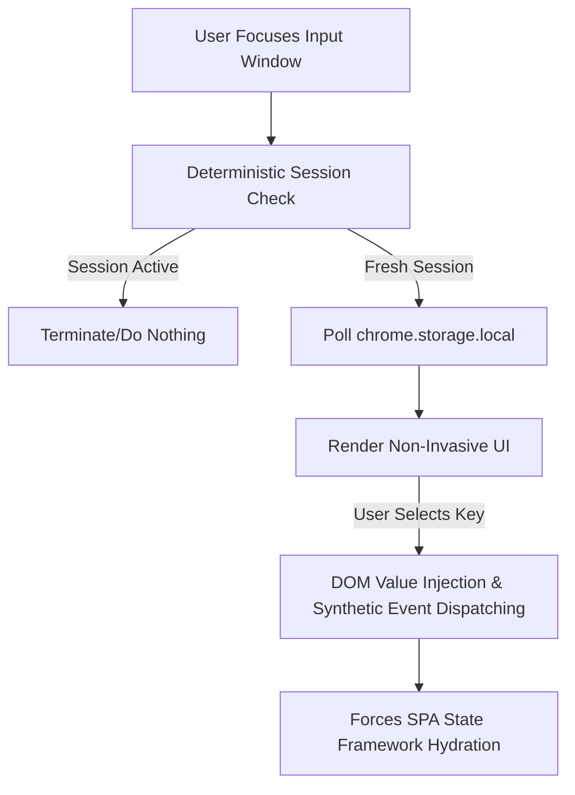

 ⚡ ContextSync

[](https://developer.chrome.com/docs/extensions/mv3/intro/)
[](#)
[](#)
[](https://www.gnu.org/licenses/gpl-3.0)

> **ContextSync** is an elite, production-grade semantic orchestration utility engineered to anchor complex, high-signal structural prompt configurations into modern Large Language Model (LLM) frontends exactly when a conversation is initiated. 

By utilizing reactive DOM interceptors and a decentralized local JSON layer, ContextSync eliminates the cognitive friction of manual prompt hydration while giving users full authority over their stored prompt data.


## 🏛️ System Architecture & Mechanics

Modern LLMs rely heavily on the initial conversational turn to lock down operational paradigms, system parameters, and constraints. ContextSync acts as a structural gatekeeper at this exact micro-moment.



## 💎 Core Capabilities & Functional Specifications

### 1. Context-Aware Session Gatekeeping (Deterministic Filtering)
ContextSync evaluates the structural state of the active browser document object model (DOM). By tracking historic node signatures (`data-testid="message"`, `div[class*="chat-history"]`, `article`, etc.), it algorithmically determines if a conversation is in its nascent state. The injection overlay fires **exclusively on the first turn**, preventing accidental configuration pollution in mid-session workflows.

### 2. Framework-Agnostic Reactive Injection
Modern web applications built on React, Next.js, and specialized custom architectures block simple, static `.value` browser text manipulation. ContextSync deploys custom synthetic event trees:
* It forces cursor focus, flushes existing inline blocks safely, and appends the payload structure natively.
* It dispatches high-priority bubble-capable `input` and `change` events directly down the DOM node tree, forcing the parent client-side state framework to instantly capture the injected text.

### 3. Persistent Semantic Key-Value Registry
Unlike storage hooks anchored to local cookies or native session variables, ContextSync stores prompt configuration locally inside the extension boundary using browser-local JSON persistence. Your stored prompts remain under your full control and are not automatically propagated through remote sync services.
* **ACID-Aligned Consistency:** All mutation requests handle configuration profiles as a flattened, encapsulated JSON document object graph (`promptMap`).
* **End-User Data Authority:** Prompt ownership is purely with the end user—export before clearing browser cache or extension data, and import from your own JSON backup.

### 4. Non-Invasive Modal Lifecycle Management
The contextual dropdown behaves with pristine user-experience mechanics. If a user triggers a text input but elects to click away, the modal executes an intentional asynchronous teardown sequence—closing immediately without affecting structural inputs, page layouts, or native focus.


## ⚙️ Installation & Developer Onboarding

Follow these steps to mount ContextSync directly into your developer runtime environment:

### **Clone the Infrastructure:**
   ```bash
   git clone [https://github.com/YOUR_USERNAME/ContextSync.git](https://github.com/YOUR_USERNAME/ContextSync.git)
   cd ContextSync
   ```

### **Mount the Extension via Chrome Developer Framework:**
* Open Google Chrome and navigate to `chrome://extensions/`.
* Enable the **Developer mode** toggle in the top-right corner.
* Click the **Load unpacked** action item located in the top-left region.
* Target and select the root directory (`/ContextSync`) containing your source file ecosystem.

### **Orchestrate Your First Master Prompt:**
* Click the **ContextSync** icon within the extension bar to launch the specialized fullscreen administrative dashboard.
* Assign a unique **Key Identifier** (e.g., `Senior Academic Researcher`) and paste your raw markdown master prompt into the payload terminal.
* Commit the configuration to local extension storage.


### 🧭 Best Practices for Local Prompt Management
* Always export your prompts before clearing cache, reinstalling the extension, or resetting browser state.
* Use the dashboard's **Export** button to create a local `prompts.json` backup.
* Use the **Import** button to restore or migrate prompt data from a trusted JSON file.
* Keep exported prompt backups in a secure local folder or version-controlled repository if you need repeatable deployment.

### 📄 Sample `prompts.json` Template
```json
{
  "Senior Academic Researcher": "You are a highly experienced academic researcher. Use formal tone, cite sources, and prioritize factual clarity.",
  "Marketing Copywriter": "Write persuasive, benefit-focused marketing copy with a conversational tone, clear calls to action, and audience empathy."
}
```

*Notes:*
* Keys must be unique strings.
* Prompt values may include line breaks or structured instructions.
* Importing merges prompts and overwrites existing keys when names collide.

## 📁 Repository Directory Matrix

```text
├── manifest.json       # Structural extension schema, host rules, and capability bounds
├── background.js      # Decoupled service worker managing administrative view routing
├── dashboard.html     # Monolithic control portal layout for Master Prompt orchestration
├── dashboard.js       # JSON CRUD mutations pipeline utilizing local storage layers
├── content.js         # Reactive UI overlay compiler and DOM state validator
└── styles.css         # UI layer formatting for sleek light/dark mode blending

```

## 🔒 Enterprise-Grade Edge Case Resolutions

* **The React State Desync Bug:** Fixed via double synthetic event dispatch (`input` + `change`), tricking reactive Virtual DOM models into scanning the programmatically injected prompt value immediately.
* **The Site-Data Flush Hazard:** Solved by keeping prompt configuration in extension-local storage under the user's control rather than relying on cloud-sync storage vectors.
* **The Textarea Loss of Focus Loop:** The insertion dropdown leverages the `mousedown` default interception clause, passing the payload configuration into target forms without taking active browser focus away from the input element.

## ⚖️ Open Source Copyleft Directive
* This software infrastructure is strongly copylefted and protected under the **GNU General Public License v3 (GPLv3)**.
* **Freedom to Fork:** Anyone may copy, distribute, modify, and run this codebase.
* **Reciprocity Requirement:** If you choose to modify this source architecture or integrate ContextSync engines into a derivative software distribution, you must open-source your entire project code layer under the exact same GPLv3 licensing terms. Closed-source proprietary redistribution is strictly prohibited.
