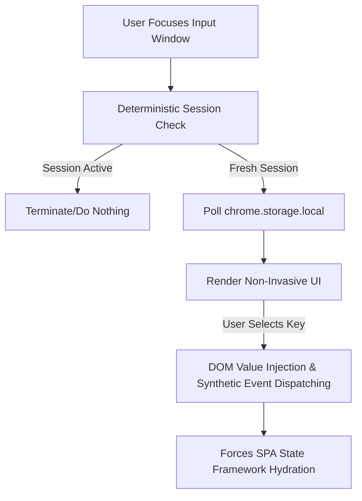

 ⚡ ContextSync

[](https://developer.chrome.com/docs/extensions/mv3/intro/)
[](#)
[](#)
[](https://www.gnu.org/licenses/gpl-3.0)

> **ContextSync** is an elite, production-grade semantic orchestration utility engineered to anchor complex, high-signal structural prompt configurations into modern Large Language Model (LLM) frontends exactly when a conversation is initiated. 

By utilizing reactive DOM interceptors and a decentralized local JSON layer, ContextSync eliminates the cognitive friction of manual prompt hydration while giving users full authority over their stored prompt data.


## 🏛️ System Architecture & Mechanics

Modern LLMs rely heavily on the initial conversational turn to lock down operational paradigms, system parameters, and constraints. ContextSync acts as a structural gatekeeper at this exact micro-moment.



## 💎 Core Capabilities & Functional Specifications

### 1. Context-Aware Session Gatekeeping (Deterministic Filtering)
ContextSync evaluates the structural state of the active browser document object model (DOM). By tracking historic node signatures (`data-testid="message"`, `div[class*="chat-history"]`, `article`, etc.), it algorithmically determines if a conversation is in its nascent state. The injection overlay fires **exclusively on the first turn**, preventing accidental configuration pollution in mid-session workflows.

Highlights
----------
- Token-based insertion: type `/masterprompt ` or `/mstp ` (case-insensitive, trailing space required) and a small overlay lists saved prompts for quick insertion. Type `/hmstp ` to authenticate with the hidden-prompts password, choose a hidden prompt, and insert its decrypted text.
- Dashboard (Options page): Create, Read, Update, Delete prompts, import/export JSON, and manage hidden prompts protected by a password.
- Popup (Action): Quick access list of prompts with a link to open the full dashboard.
- Storage: Uses `chrome.storage.local` with backward compatibility for legacy key `promptMap` and a new key `contextsync_prompts`.
- Hidden prompts: Store prompts in a separate hidden bucket (`hidden_prompts`); require a password to view/unhide. Password is stored as a SHA-256 hash in `hidden_prompts_password_hash`.
- Cross-tab sync: BroadcastChannel + `chrome.storage.onChanged` ensure other tabs see updates.
- Build: Vite + TypeScript (strict) with a React popup and vanilla TS dashboard; content script is compiled to a single `dist/content.js` file suitable for MV3.

Behavior Details
----------------
- Trigger detection: content script watches `input` events and matches the visible `/masterprompt ` and `/mstp ` commands or the password-protected `/hmstp ` command. When matched it computes the token range and shows the overlay positioned near the caret.
- Insertion semantics: Selecting a prompt removes the entire token (including the trailing space), inserts the prompt text as plain text, appends a newline, and dispatches `input` and `change` events to ensure reactive frontends pick the updated value.
- Content-editable support: The script computes character offsets and uses Range APIs to replace text within contenteditable nodes reliably.

UI Notes
--------
- Dashboard: two-column layout — left column contains the prompt list (scrollable, shows up to 10 prompts before scrolling), right column contains create/edit form.
- Popup: compact list (scrollable, shows up to 5 prompts before scrolling) and a Dashboard button.
- Overlay: the in-page overlay is scrollable and shows up to 5 prompts at a time; uses the `.prompt-injector-overlay` styles from `styles.css`.

Storage Keys & Compatibility
---------------------------
- `promptMap` (legacy) — older installations may have prompts stored here.
- `contextsync_prompts` (current main prompts key).
- `hidden_prompts` — map of key → AES-GCM encrypted prompt data moved into the hidden store.
- `hidden_prompts_password_hash` — SHA-256 hex hash for the hidden prompts password.

Hidden Prompts (Password Protected)
-----------------------------------
- From the Dashboard you can "Hide" a prompt. Hiding requires entering a password: if no password exists it will be stored (hashed) and used for subsequent unlock attempts.
- To view hidden prompts use the "Show Hidden" button in the dashboard and provide the password. Hidden prompts are shown in a separate section and can be Unhidden (moved back to visible prompts) or permanently deleted.

Developer / Build
-----------------
Prerequisites: Node.js (16+), npm

Install and develop:
```bash
npm install
npm run dev        # run vite for local development (popup/dashboard hot reload)
npm run build      # produce a production-ready `dist/` directory
npm run typecheck  # run TypeScript strict checks
```

Output notes:
- Built artifacts land in `dist/` and include `popup.html`, `dashboard.html`, `content.js`, `background.js`, and `styles.css`.

Testing
-------
- Project uses Vitest for unit tests. Test scaffolding exists under `src/*.test.ts` and `src/*.test.tsx`.
- Coverage is configured in the project; recommended command:
```bash
npm test -- --coverage
```
Note: Some environment dependencies (Vitest + coverage provider) may require initial npm installs; see project `package.json` devDependencies.

Security & Limitations
----------------------
- Password storage: ContextSync stores only a SHA-256 hash of the hidden prompts password. Hidden prompt contents are encrypted with AES-GCM using a PBKDF2-derived key. Exported JSON contains visible prompts, encrypted hidden prompts, and the password hash in one document.
- Content script compatibility: The injection behavior is intentionally conservative. It uses synthetic `input` and `change` events to prompt frameworks to sync; however, sites with aggressive input sanitization or CSP may interfere with injection.

Contributing
------------
- The codebase is structured to keep the content script small and browser-compatible. When contributing:
  - Prefer minimal, focused changes to `src/content.ts` (content script) and `src/dashboard/main.ts` (dashboard logic).
  - Keep UI-only changes inside `dashboard.html`/`styles.css` and the React popup in `src/popup`.
  - Add unit tests alongside new logic and aim for high coverage on storage and token detection logic.

Files of interest
-----------------
- `src/content.ts` — token detection and overlay injection logic (compiled to `dist/content.js`).
- `src/shared/storage.ts` — unified storage accessor, legacy-key merging, hidden-prompt helpers, and BroadcastChannel hooks.
- `src/dashboard/main.ts` — dashboard wiring, import/export, CRUD, hide/unhide flows.
- `src/popup/PopupApp.tsx` — React popup UI listing prompts and linking to the dashboard.
- `styles.css` — overlay and dashboard styling.

License
-------
This project is distributed under GPLv3. See the `LICENSE` file for full terms.

Questions or next steps
----------------------
- Want me to encrypt hidden prompts with the user password? I can add client-side encryption (AES-GCM) and store only ciphertext plus a salt.
- I can also add nicer password modals (instead of prompt/alert) and stronger UX for managing hidden prompts.

Enjoy — reload the extension from `dist/` in Chrome's Extensions page to test changes.
